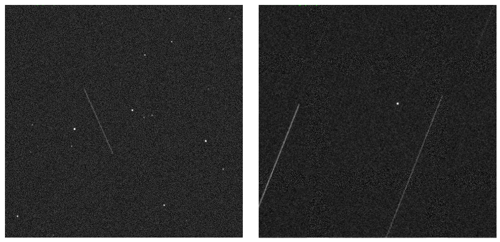

.. SatIST documentation master file, created by
   sphinx-quickstart on Sat May 17 19:02:41 2025.
   You can adapt this file completely to your liking, but it should at least
   contain the root `toctree` directive.

Welcome to SatIST's documentation!
==================================

The Satellite Image Simulation Toolkit (SatIST) is a python software package designed 
to generate diverse and realistic satellite imaging scenarios. It serves as a toolkit 
for simulating data that supports the development and testing of algorithms used in 
satellite detection, calibration, and characterization. SatIST provides a suite of 
simulation tools that allow users to replicate various satellite observation conditions, 
including sidereal and target tracking. By enabling the creation of scenarios that mimic 
real-world satellite operations, SatIST facilitates advancements in satellite image data
processing and the study of satellite behavior under different observational parameters.

.. toctree::
   :maxdepth: 2
   :caption: Contents:

   Example of simulated image output of SatIST. Left: Example image taken with sidereal (star) tracking - 
   fast moving statillite appears as a streak across the image. Right: Example image take with satillite 
   tracking - the stars appear as streaks and the statlite appears as a point source. 

.. note:: Finding your way around

   A good place to get started is with the installation guide, getting started page and
   the the tutorial examples.

   If you are here to develop on SatIST, please head over to the contributing guide.

   If you have issues with the software or need support please open a `github issue <https://github.com/LLNL/satist/issues>`_.

Contents
--------

.. toctree::
   :titlesonly:
   :maxdepth: 1

   installation
   gettingstarted
   background
   tutorials
   acknowledgements
   contributing
   developer
   changelog
   references
   api

Indices and tables
==================

* :ref:`genindex`
* :ref:`modindex`
* :ref:`search`
